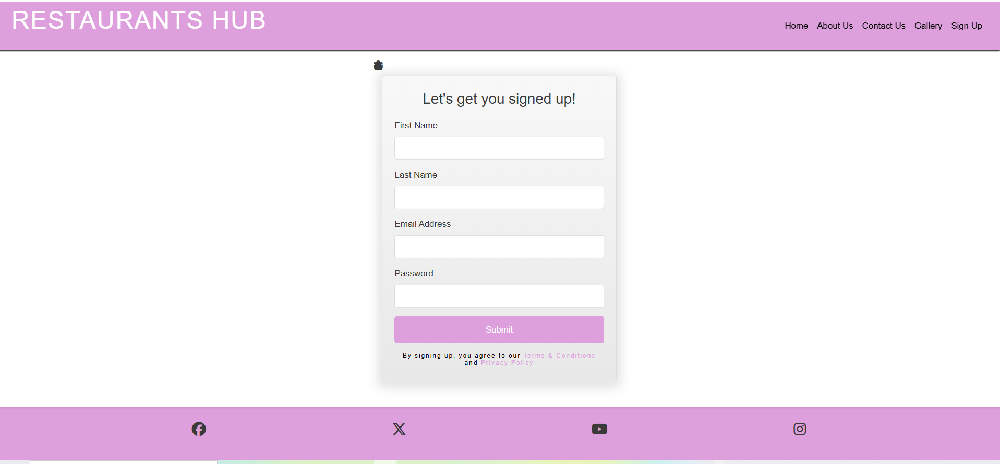

# Restaurants Hub | The Spoon
Restaurant hub | The Spoon is a go to plateform for the public to place meal orders from variety of restaurant brands all over the UK. 
Designed with simplicity in order to offers a browsing experience, allowing to place food effortlessly and gets it delivered to thier door steps. It also have the ability for collection. Start your food delivery or collection order today from THE SPOON. We are a food delivery service that connects you with the best local restaurants in your area. Whether you're craving a juicy burger, spicy jollof rice, or crispy fried chicken, we've got you covered. Our easy-to-use platform allows you to browse menus, place orders, and track your delivery in real-time. With Restaurants Hub, you can enjoy delicious meals from the comfort of your own home.

Visit The Spoon right here: https://charl-90.github.io/restaurant-hub-ms1/gallery.html 

<!-- TOC -->
# Table of Content

- [Restaurants Hub | The Spoon](#restaurants-hub--the-spoon)
- [Project Goals](#project-goals)
- [Design Layouts](#design-layouts)
- [Icons](#icons)
- [Color Choices](#color-choices)
- [Feature Layouts](#feature-layouts)
- [Landing Page](#landing-page)
- [Gallery](#gallery)
- [Sign Up](#sign-up)
- [About Us](#about-us)
- [Contact Us](#contact-us)
- [Technologies Used](#technologies-used)
- [Testing](#testing)
- [Test Artifacts](#test-artifacts)
- [Performance Testing](#performance-testing)
- [CI/CD Pipeline](#cicd-pipeline)

# Project Goals
  
As a user on Restaurant hub | The Spoon website, I am expected to able to browse a restaurant of my choice.  
I should be able to place a food order effortlessly and gets it delivered to my door steps. I should also be able to place order for collection.  
As a user visiting the Restaurant hub | The Spoon website for the first time, I should be able to register as a new user.
I should have a ability to read the terms and conditions as well as the privacy policy.

# Requirement Spacification 
As a user visiting the Restaurant | The Spoon website. I will like the ability to be able to register and place mu orders, book for home deliveries or pick-up collections.
* Given I am a new user, I will want to sign up.
* When I fill in the sign-up form
* And I click the submit bottum.
* Then I should be taken to the Code Insitude Congratulations! page. 
* Given I am a new user, I will want to place an order for a home delivery or pick up collections

* Given I am a new user, I will link to browse other restaurant brands of thier choice

# Design Layouts

# Font 
- Google Fonts (https://fonts.google.com/specimen/Open+Sans)
- kit.fontawaesome.com

    - The sans-serif font I used is known for it's bold and uppercase letters, offering a strong and modern look to websites.

# Feature Layouts:
- Restaurant hub | The Spoon offers a variety range of meals from defferent domograghic settings to users. User experience with simple layouts enabling quick access to users. The gallery page provides verious dishes a user can see and choose from.

# Landing Page
This page will provide a welcoming feel to the user with available links of where to go.

# Gallery
User should be able to see some of the amazing and delicious meals available

# Sign Up
User should be able to register when they first visit the website.
Sign uo form should be clear and easy for fill in.

# About Us

# Contact Us
- This page has been design to intensionally take the user to a 404 Page Not Found

# Technologies Used
- Html
- css 
- Core Java for Test Automation 
- GitHub
- Selenium
- Git Bash

# Testing
- Manuel Testing (Test Activities)
- Test Caese 
    - Set of test steps,  test conditions, and expected results used to verify that a specific feature of a software application functional specifications are correct and meets the functional requirements. It's a detailed documentation that provides step-by-step instructions for a tester to follow, including prerequisites, input data, and the expected results. The main purpose is to check that the software behaves as expected, uncover defects / bugs, and ensure it performs as intended.

     # Test Case ID181025:
     - Test to verity that new users are able to resgister and submit a form.
     - Test to verify that the input fields for first name accepts only letters

     - Test to verify that the input fields for last name accepts only letters

     - Test to verify that the input fields for first name does not accepts numbers

     - Test to verify that the input fields for last name does not accepts number

     - Test to ensure that the input fields for first name does not accepts special character 

     - Test to ensure that the input fields for last name does not accepts special character

      

# Test Scripts
   -  The Test scripts will provide a set of instructions that will be performed on the system under testing to ensure that the system functions as expected and fit for purpose. 

 | Test Steps | Expected Result |
 |:-----------|:----------------|
 |Go to url : https://charl-90.github.io/restaurant-hub-ms1/index.html   |Website opens|
 |Visually verify that the landing page image is in the center| Image is in the center of the page
 |Click on the Sign up link| Sign up link opens|
 |Provide first name, last name, password, email and click submit buttom | User should be taken to Code Insitude Congratulations! page |
  
  

# Automation Testing
- Selennium test script (WIP)

#  Testing Tools
- VS Code

# Test Artifacts
- Test Report

# CI/CD Pipeline
- WIP

**Wireframe Desktop**

**Wireframe Mobile**

**Libaries**
- kit.fontawaesome.com,
- Google font style
- Selenium for Java
- Java Extensions
- Maven

